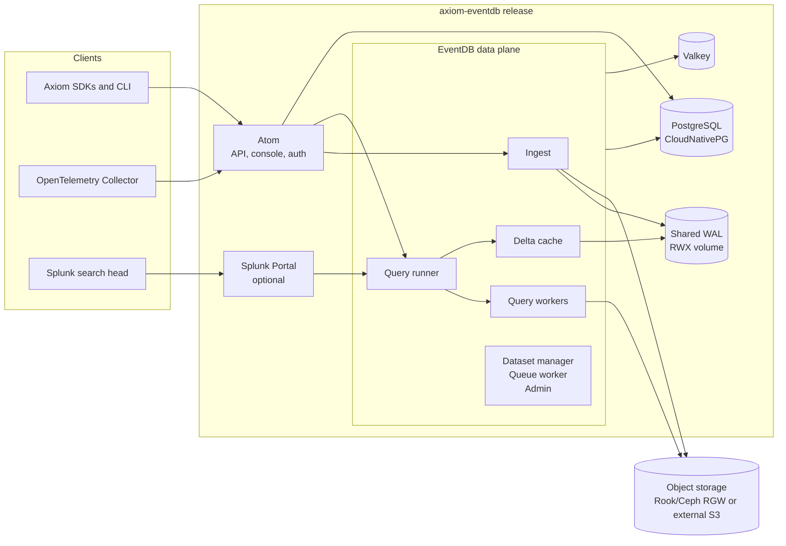

Self-hosted EventDB runs Axiom's event datastore on Kubernetes infrastructure that you operate: bare metal, an on-premises cluster, or a cloud account of your own. The deployment path is one Helm chart, `axiom-eventdb`, that packages the EventDB workloads together with pinned infrastructure dependencies and, optionally, [Atom](#atom), the management plane and console that gives the datastore an authenticated, Axiom-compatible API.

This section covers a bare-metal deployment end to end. Start with [Requirements](/self-hosted/requirements), then follow [Deploy on bare metal](/self-hosted/deploy-bare-metal).

<Note>
Self-hosted EventDB is in early access. Chart versions are published as `0.0.1-alpha.<sha>` prereleases and the values interface can change between releases. Axiom provides registry credentials, image tags, and a licence configuration during onboarding.
</Note>

## What the chart deploys

The chart installs one Helm release, in one namespace, that owns the whole stack.

### First-party workloads

| Component | Kind | Role |
| :--- | :--- | :--- |
| `eventdb-ingest` | StatefulSet | Accepts events, buffers them in the shared WAL, and flushes blocks to object storage. |
| `eventdb-query-runner` | Deployment | Plans queries and fans them out to workers and the delta cache. |
| `eventdb-query-worker` | Deployment | Scans blocks in object storage. |
| `eventdb-delta-cache` | Deployment | Serves not-yet-flushed data from the WAL to queries. |
| `eventdb-dataset-manager`, `eventdb-queue-worker`, `eventdb-admin` | Deployments | Dataset coordination, background jobs (deletes, trims, vacuums), and operator tooling. |
| `eventdb-janitor`, `eventdb-scan-nfs` | CronJobs | Housekeeping and orphaned-WAL recovery. |
| `axiom-atom` | Deployment | Optional. The management plane, authenticated API, and console. |
| `axiom-splunk-portal`, `axiom-grafana-portal` | Deployments | Optional query front ends for Splunk and Grafana. |

Every first-party container runs hardened: non-root UID 65534, all capabilities dropped, no privilege escalation, `RuntimeDefault` seccomp, a read-only root filesystem, and no Kubernetes API token.

### Pinned dependencies

| Function | Implementation | Chart |
| :--- | :--- | :--- |
| Object storage | Rook-managed Ceph with the RGW S3 gateway, or an S3-compatible store you already run | `rook-release/rook-ceph`, `rook-release/rook-ceph-cluster` `v1.20.3` |
| Relational state | PostgreSQL 17, three instances, managed by CloudNativePG | `cnpg/cloudnative-pg` `0.29.0`, `cnpg/cluster` `0.8.1` |
| Cache | Valkey with replication | `valkey/valkey` `0.11.0` |
| Job queue | PostgreSQL (recommended), or NATS JetStream | `nats/nats` `2.14.2` when selected |

Every dependency is pinned to an exact chart version and to the SHA-256 of its archive. Operator CRDs ship in companion subcharts so a release can create its Ceph and PostgreSQL custom resources in the same Helm transaction that installs the operators.

## Atom

EventDB itself has no notion of organizations, users, or API tokens. Its ingest, query, and admin endpoints are unauthenticated and must never be exposed beyond the cluster.

Atom is the layer that turns the headless datastore into a product surface. It adds a PostgreSQL-backed management plane (datasets, API tokens, users, audit log), an Axiom-compatible ingest and APL query API in front of EventDB, and a web console at `/ui/`. Because Atom speaks Axiom's public API contracts, the Axiom SDKs, the CLI, OpenTelemetry exporters, and the Splunk and Grafana portals work against it unchanged.

Atom is the only workload in the chart that is designed to be published outside the cluster, through an Ingress with TLS. The bare-metal guide enables it.

## What you provide

The chart deliberately installs nothing by default: a bare `helm install` creates no operators, claims no disks, and exposes no endpoints. A real deployment is a values file that opts into each section. You bring:

- A conformant Kubernetes cluster with a block `StorageClass` and a ReadWriteMany-capable one for the shared WAL. See [Requirements](/self-hosted/requirements).
- Dedicated raw disks for Ceph, or an external S3-compatible object store.
- A private container registry that mirrors the EventDB, Atom, and dependency images.
- Kubernetes Secrets holding the database, cache, object-storage, and Atom credentials.
- An ingress controller and TLS certificate for Atom.
- Optionally, Prometheus Operator for metrics and metrics-server for autoscaling.

## Deployment modes

The top-level `mode` value selects the topology of the EventDB workloads:

| Mode | Use | Replicas |
| :--- | :--- | :--- |
| `single` | One-node development clusters | One replica of every service |
| `multi` | Production | Four ingest, three delta cache, four query runner, six query worker pods by default, with PodDisruptionBudgets and optional autoscaling |

The multi-mode defaults are measured, not guessed. They hold 16,000 events per second with 24 concurrent queries on the validation deployments and add up to about 15 cores and 21 GiB of requests for EventDB itself. See [Requirements](/self-hosted/requirements#sizing) for how to scale beyond that.

## In this section

| Page | Contents |
| :--- | :--- |
| [Requirements](/self-hosted/requirements) | Cluster, node, storage, object-storage, network, and credential requirements. |
| [Deploy on bare metal](/self-hosted/deploy-bare-metal) | The step-by-step install: cluster preparation, image mirroring, storage, values, install, and verification. |
| [Operate](/self-hosted/operate) | Expose Atom, upgrade, scale and autoscale, and monitor with Prometheus. |
| [Back up and restore PostgreSQL](/self-hosted/backup-restore) | Continuous WAL archiving, scheduled base backups, and point-in-time recovery. |
| [Troubleshoot](/self-hosted/troubleshoot) | Symptoms, causes, and fixes for the failure modes seen on real deployments. |
