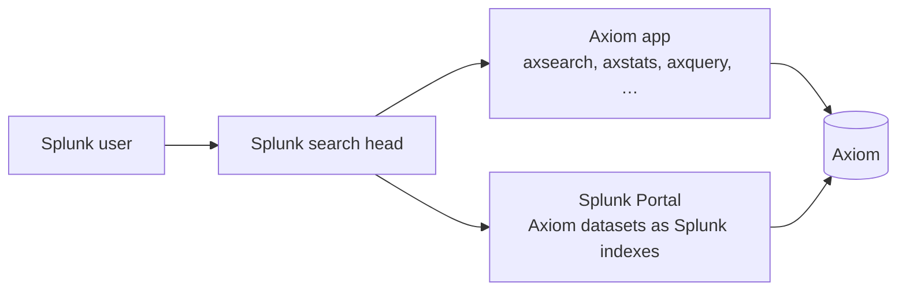

Axiom connects to Splunk in two ways. Both let your team work with Axiom data from the Splunk interface they already know, without moving or duplicating data. The work of filtering and aggregating happens inside Axiom, and Splunk receives compact results it can shape, chart, and alert on.

- The **[Axiom for Splunk app](/splunk/app/setup)** adds a set of `ax` commands to SPL. You query Axiom datasets explicitly from any Splunk search, enrich existing Splunk events with Axiom context, and run raw APL when you need the full Axiom query language. Any Splunk user can install and configure it with an Axiom API token.
- The **[Axiom Splunk Portal](/splunk/portal/overview)** registers with your Splunk deployment as a federated search provider and makes Axiom datasets appear as ordinary Splunk indexes, addressed as `index=federated:<dataset>` or, in transparent mode, directly by name as `index=<dataset>`. Your team searches them in plain SPL, and existing dashboards, saved searches, and alerts work unchanged. A Splunk admin sets it up once for the whole deployment.

## Choose between the app and the Portal

The two integrations solve different problems and work well together in the same deployment.

| | Axiom for Splunk app | Axiom Splunk Portal |
| --- | --- | --- |
| Query syntax | New `ax` commands, plus raw APL | Plain SPL: `index=federated:<dataset>`, or `index=<dataset>` in transparent mode |
| Existing dashboards and saved searches | Adapt them to use `ax` commands | Work unchanged |
| Setup | Any user installs the app with an API token | Splunk admin configures a federated provider |
| Enrich existing Splunk events with Axiom data | Yes, with the purpose-built `axlookup` command | Yes, with standard SPL patterns like `join` and subsearches |
| Full APL access | Yes, with `axquery` | No |
| Splunk lookups and data models over Axiom data | No | Yes, in transparent mode |
| Suited to | Analysts who mix Axiom and Splunk data in one pipeline | Teams who live in Splunk and want Axiom data to feel native |

Choose the **app** when:

- You want to get started without changing Splunk deployment settings. Installing the app doesn’t require federation configuration.
- You want to enrich events that are already in Splunk with context from Axiom. The `axlookup` command joins Axiom fields onto Splunk search results in one streaming command, with batching and field normalization handled for you.
- You want the full power of APL from inside Splunk. The `axquery` command runs any APL query and returns the results as Splunk events.

Choose the **Splunk Portal** when:

- Your team already has Splunk dashboards, saved searches, and alerts, and you want them to run against Axiom data without edits.
- End users shouldn’t have to learn anything new. Axiom datasets appear as indexes, and everyone keeps writing the SPL they know.
- You use Splunk knowledge objects like lookups and data models and want them to work against Axiom data. Transparent mode supports this.

A useful way to remember the difference: the app brings Axiom’s query language into your Splunk searches, and the Portal brings Axiom datasets into Splunk itself.

## What happens to your data

Neither integration copies data into Splunk. Axiom stores and queries your event data, and Splunk receives results.

Both integrations push the expensive work down into Axiom. An aggregation like a count by service over billions of events runs inside Axiom and returns a handful of rows to Splunk. Results are exact, not sampled, at any dataset size. For more information on how work is divided between Axiom and the Splunk search head, see [How the Splunk Portal works](/splunk/portal/overview).

Access is controlled with Axiom API tokens. Each integration authenticates with a token that has query permissions on the datasets you choose to expose. Revoke the token, and access is gone. For more information, see [Tokens](/reference/tokens).

## What’s next

- [Install and configure the Axiom for Splunk app](/splunk/app/setup)
- [Set up the Splunk Portal](/splunk/portal/set-up-standard)
- [Translate SPL to APL](/apl/guides/splunk-cheat-sheet)
