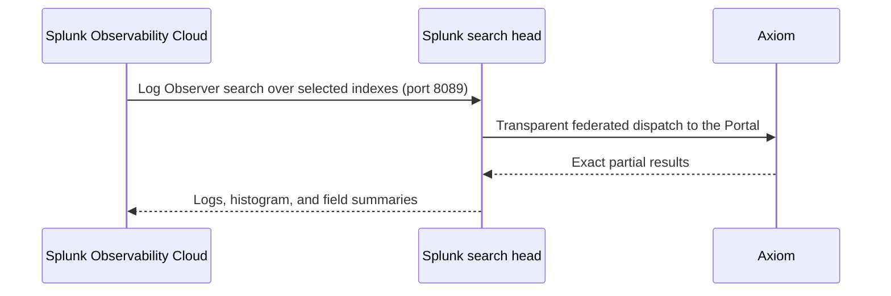

Splunk Observability Cloud doesn't store logs. Its Log Observer feature reads logs from a Splunk platform search head through [Log Observer Connect](https://help.splunk.com/en/splunk-observability-cloud/manage-data/view-splunk-platform-logs/introduction-to-splunk-log-observer-connect): Observability Cloud connects to the search head's management port and runs ordinary searches against the indexes you select.

Because the Axiom Portal for Splunk makes Axiom datasets searchable as ordinary indexes in [transparent mode](/splunk/portal/set-up-transparent), this composes: point Log Observer Connect at a search head with a transparent-mode Portal provider, and Observability Cloud renders logs that live only in Axiom. The log list, the time histogram, and the field summaries in the Logs explorer are all served by searches that federate to Axiom.

This completes Splunk's own three-signals architecture — metrics and traces flow to Observability Cloud from the OpenTelemetry Collector as usual, and logs are correlated in from the Splunk platform — with Axiom as the log store. You keep the Observability Cloud experience and pay no Splunk log ingest. Spans stored in Axiom as events are searchable through the same connection, so trace-shaped data is browsable in the Logs explorer too.



## Prerequisites

- A Splunk Enterprise search head with the Portal registered as a [transparent mode provider](/splunk/portal/set-up-transparent), and admin access to it.
- Administrator access to a Splunk Observability Cloud organization that includes Log Observer Connect.
- Network access from Observability Cloud to the search head's management port (8089) over HTTPS. The search head needs a hostname reachable from Splunk's cloud and a TLS certificate you can provide during setup. Restrict access to [Splunk's published Log Observer Connect IP ranges](https://help.splunk.com/en/splunk-observability-cloud/manage-data/view-splunk-platform-logs/set-up-log-observer-connect-for-splunk-enterprise) where possible.

## Prepare the search head

<Steps>
<Step title="Create local stub indexes for your Axiom datasets">
Log Observer Connect discovers indexes from the search head's local index list, and transparent-mode datasets aren't in it. Create an empty local index for each Axiom dataset you want to expose, with the exact same name:

```bash
curl -u admin:<password> -k https://<search-head>:8089/services/data/indexes \
  -d name=<dataset-name>
```

Searches over these index names transparently merge the empty local index with the Axiom data, so everything Log Observer retrieves comes from Axiom.
</Step>
<Step title="Create a service role">
Create a role for the Log Observer Connect service account:

- Import the `user` role.
- Allow exactly the stub indexes you created in the previous step.
- Add the `edit_tokens_own` capability. Observability Cloud authenticates once with the service account password and then mints Splunk authentication tokens, which requires this capability.
- Make sure `indexes_list_all` isn't selected.
- Set the user search job limit to at least 4 per concurrent Log Observer user. One Logs explorer interaction fans out several parallel searches.
</Step>
<Step title="Create the service account">
Create a user with the role from the previous step and a strong password. This is the account you enter in the Observability Cloud connection wizard.
</Step>
</Steps>

## Create the connection in Observability Cloud

<Steps>
<Step title="Open Logs Connections">
In Splunk Observability Cloud, go to **Data Management**, and follow the guided onboarding for **Connect to Splunk Enterprise**, or go directly to **Logs Connections** and click **Add new connection**. Select **Splunk Enterprise**.
</Step>
<Step title="Enter the connection details">
- For the service account username and password, enter the account you created on the search head.
- For the Splunk platform URL, enter the externally reachable management endpoint, for example `https://splunk.example.com:8089`. Any HTTPS port works if a proxy fronts the management port.
- For the certificate, upload or paste the PEM chain the endpoint serves.

Click **Save and Continue**. Observability Cloud validates the connection against the search head before proceeding.
</Step>
<Step title="Configure permissions and activate">
Choose which Observability Cloud users can use the connection, then click **Save and Activate**.
</Step>
<Step title="Query your logs">
Go to **Logs** and open the **Logs explorer**. Select an index you exposed, and filter, aggregate, and browse — the results are served from Axiom through the Portal.
</Step>
</Steps>

<Note>
After you create the organization's first Logs connection, the Logs explorer can render blank until your session picks up the new entitlement. If that happens, log out of Observability Cloud and log back in.
</Note>

## Limitations

- Log Observer Connect reads event indexes. Metrics indexes aren't part of this path, and internal indexes (names starting with `_`) aren't supported by Log Observer Connect.
- Observability Cloud's APM and Infrastructure Monitoring have their own ingest and can't read from a federated provider. Use the OpenTelemetry Collector to send those signals to Observability Cloud directly, and keep full-fidelity logs — and optionally traces — in Axiom.
- Every active Log Observer user runs several concurrent searches through the search head and the Portal. Size the service role's search job limit accordingly.
