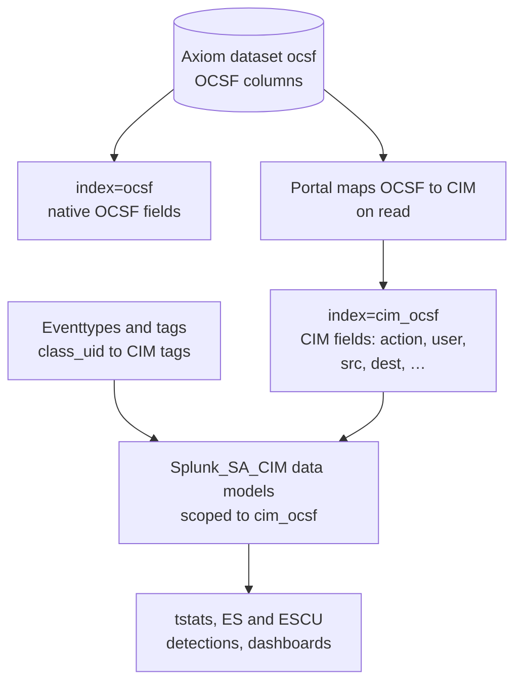

Security teams in Splunk build on the [Common Information Model](https://help.splunk.com/en/splunk-enterprise-security-8/common-information-model/8.5/introduction/overview-of-the-splunk-common-information-model) (CIM): data models such as Authentication and Network_Traffic, `tstats` searches over them, and the Enterprise Security (ES) detections built on both. OCSF data uses different field names for the same ideas. For example, CIM’s `user` is OCSF’s `user.name` in a logon, and CIM’s `action` comes from `status_id` in a logon or from `action_id` in network traffic.

The Axiom Portal for Splunk bridges the two at read time. It presents an [OCSF dataset in Axiom](/use-cases/ocsf) as a second Splunk index whose events carry CIM field names and values. Nothing is copied or rewritten in Axiom. This page covers the last step of the OCSF flow: searching OCSF data from Splunk.

Searching OCSF data as CIM requires transparent mode and the [Axiom for Splunk app](/splunk/app/setup) 1.4.0 or later on the search head. It maps the OCSF classes and CIM data models listed on this page.

## How it works



Three pieces work together:

- **Two indexes for one dataset.** For every Axiom dataset that looks like OCSF, the Portal advertises two indexes. `index=ocsf` shows the native OCSF fields. `index=cim_ocsf` points at the same dataset and adds CIM fields to every event. A dataset looks like OCSF when its `class_uid` field is an integer and it has at least one of `metadata.version`, `category_uid`, `type_uid`, `activity_id`, or `severity_id`.
- **CIM fields computed in Axiom.** When you search a `cim_` index, the Portal computes the CIM fields inside the Axiom query, before filtering and aggregation. Filters such as `action=failure` and aggregations such as `stats count by user` therefore run in Axiom, like any other pushed-down search.
- **Eventtypes and tags on the search head.** CIM data models find events by tag, for example `tag=authentication`. A set of eventtypes selects OCSF events by `class_uid` and attaches the CIM tags. In transparent mode, the search head expands tags into `class_uid` constraints before it sends the search to the Portal.

### Class-aware mapping

The same CIM field comes from different OCSF fields depending on the event class. The Portal reads the `*_id` enumerations first and falls back to their string siblings. For example:

| CIM field | Authentication (`3002`) | Network Activity (`4001`) | Process Activity (`1007`) |
| --- | --- | --- | --- |
| `action` | `success` or `failure`, from `status_id` | `allowed` or `blocked`, from `action_id`, then `disposition_id` | `allowed` or `blocked`, from `action_id`, then `disposition_id` |
| `user` | The account that logged on, `user.name` | The acting account, `actor.user.name` | The acting account, `actor.user.name` |
| `dest` | The system logged on to, `dst_endpoint.ip` or `dst_endpoint.hostname` | The remote peer, `dst_endpoint.ip` or `dst_endpoint.hostname` | The device the event happened on, `device.hostname` or `device.ip` |
| `src` | `src_endpoint.ip` or `src_endpoint.hostname` | `src_endpoint.ip` or `src_endpoint.hostname` | `src_endpoint.ip` or `src_endpoint.hostname` |
| `severity` | Lowercase CIM severity from `severity_id` | Lowercase CIM severity from `severity_id` | Lowercase CIM severity from `severity_id` |

For example, here is a failed logon from the [OCSF for Axiom sample data](/use-cases/ocsf/query#filter-on-promoted-columns) in the two indexes:

| OCSF field in `index=ocsf` | Value | CIM field in `index=cim_ocsf` | Value |
| --- | --- | --- | --- |
| `status_id` | `2` | `action` | `failure` |
| `user.name` | `heidi` | `user` | `heidi` |
| `user.domain` | `CORP` | `dest_nt_domain` | `CORP` |
| `src_endpoint.ip` | `10.24.111.174` | `src` | `10.24.111.174` |
| `dst_endpoint.hostname` | `dc01.corp.example.com` | `dest` | `dc01.corp.example.com` |
| `auth_protocol` | `Kerberos` | `authentication_method` | `Kerberos` |
| `status_detail` | `Unknown user name or bad password.` | `reason` | `Unknown user name or bad password.` |
| `severity_id` | `3` | `severity` | `medium` |

Events in `index=cim_ocsf` keep their OCSF fields as well, so you can mix both vocabularies in one search. Where OCSF and CIM share a field name, such as `action`, `status`, and `severity`, the `cim_` index shows the CIM value for the classes the mapping covers and the native OCSF value for the others.

The mapping reads only the typed columns of the dataset. Attributes stored under the `unmapped` map field don’t become CIM fields. Arrays of objects become multivalue CIM fields: `cve` from `vulnerabilities`, `file_hash` from `file.hashes`, `process_hash` from `process.file.hashes`, `answer` from `answers`, and `mitre_technique_id` from `attacks`. `cvss` is the first CVSS base score of the first vulnerability only.

## Supported data models

| CIM data model | OCSF classes | Tags |
| --- | --- | --- |
| Authentication | Authentication (`3002`), logon activity (`activity_id=1`) only | `authentication` |
| Network_Traffic | Network Activity (`4001`) | `network`, `communicate` |
| Network_Resolution | DNS Activity (`4003`) | `network`, `resolution`, `dns` |
| Network_Sessions | DHCP Activity (`4004`) | `network`, `session`, `dhcp` |
| Web | HTTP Activity (`4002`) | `web` |
| Email | Email Activity (`4009`) | `email` |
| Endpoint.Processes | Process Activity (`1007`) | `process`, `report` |
| Endpoint.Filesystem | File System Activity (`1001`) | `endpoint`, `filesystem` |
| Endpoint.Registry | Registry Key Activity (`201001`), Registry Value Activity (`201002`) | `endpoint`, `registry` |
| Endpoint.Services | Windows Service Activity (`201004`) | `service`, `report` |
| Change, including Account_Management | Account Change (`3001`), User Access Management (`3005`), Group Management (`3006`) | `change`, `account` |
| Change | Entity Management (`3004`), Scheduled Job Activity (`1006`), API Activity (`6003`) | `change` |
| Change, auditing changes | Event Log Activity (`1008`) | `change`, `audit` |
| Intrusion_Detection and Alerts | Detection Finding (`2004`), Security Finding (`2001`) | `ids`, `attack`, `alert` |
| Vulnerabilities | Vulnerability Finding (`2002`) | `report`, `vulnerability` |
| Data_Loss_Prevention | Data Security Finding (`2006`) | `dlp`, `incident` |

Data models without an OCSF source, such as Risk, Certificates, Updates, and the inventory data models, return no OCSF events. OCSF classes not listed in the table keep their native fields in the `cim_` index and match no CIM data model.

## Requirements

- A Splunk Enterprise 9.1 or later search head.
- The Portal registered as a [transparent mode provider](/splunk/portal/set-up-transparent), with the search head’s knowledge objects turned on. Standard mode doesn’t expand tags or send data model definitions, so the CIM mapping doesn’t work with it.
- The [Axiom for Splunk app](/splunk/app/setup) 1.4.0 or later on the search head. It provides the eventtypes and tags that connect OCSF classes to CIM data models.
- The [Splunk Common Information Model add-on](https://splunkbase.splunk.com/app/1621) (`Splunk_SA_CIM`) on the search head. Enterprise Security includes it.
- An OCSF dataset in Axiom that follows the [Axiom OCSF schema](/use-cases/ocsf#the-axiom-ocsf-schema). For more information, see [Send OCSF data to Axiom](/use-cases/ocsf/send-data).
- A dataset name that Splunk accepts as an index name: lowercase letters, digits, underscores, and hyphens, starting with a letter or digit. The `cim_` prefix is reserved, so the Portal can’t search a dataset whose own name starts with `cim_` as a native index.

## Set up OCSF as CIM

These steps use a dataset named `ocsf`. Replace it with the name of your dataset.

<Steps>
<Step title="Install the Axiom for Splunk app">
Install or upgrade the Axiom for Splunk app to 1.4.0 or later on the search head from Splunkbase. {/* TODO-SPLUNKBASE: replace with the Splunkbase listing link once 1.4.0 is published there; until then, keep the GitHub release fallback below. */}If 1.4.0 isn’t available on Splunkbase yet, install it from the [GitHub release](https://github.com/axiomhq/splunk-app/releases/tag/v1.4.0) instead. {/* TODO-GITHUB-RELEASE: confirm the v1.4.0 tag name and that axiomhq/splunk-app releases are public. */} Complete the app’s setup page, then restart Splunk. For more information, see [Set up the Axiom for Splunk app](/splunk/app/setup). The app ships eventtypes that select OCSF events by `class_uid` and tags them for the CIM data models in [Supported data models](#supported-data-models). They’re shared with every app on the search head, including Splunk_SA_CIM and Enterprise Security.
</Step>
<Step title="Check the CIM index">
The `cim_` index appears automatically once the dataset contains OCSF data. Search it with a tag to confirm that tags expand and CIM fields are present:

```spl
index=cim_ocsf tag=authentication | stats count by action, user
```

If `cim_ocsf` isn’t found, check that the dataset name meets the [requirements](#requirements) and that it contains OCSF events. The Portal checks a dataset again within 15 minutes after it last found no OCSF data, or within 2 minutes if the dataset was empty.
</Step>
<Step title="Scope the CIM data models to the CIM index">
Every Splunk_SA_CIM data model starts its constraint with an index macro, such as `` `cim_Network_Traffic_indexes` ``. By default the macro matches every index but names none. The Portal needs a concrete `cim_` index in the constraint to know which Axiom dataset to search, so set the macro of each data model you use to one OCSF dataset index:

| Data model | Macro |
| --- | --- |
| Alerts | `cim_Alerts_indexes` |
| Authentication | `cim_Authentication_indexes` |
| Change | `cim_Change_indexes` |
| Data Loss Prevention | `cim_DLP_indexes` |
| Email | `cim_Email_indexes` |
| Endpoint | `cim_Endpoint_indexes` |
| Intrusion Detection | `cim_Intrusion_Detection_indexes` |
| Network Resolution | `cim_Network_Resolution_indexes` |
| Network Sessions | `cim_Network_Sessions_indexes` |
| Network Traffic | `cim_Network_Traffic_indexes` |
| Vulnerabilities | `cim_Vulnerabilities_indexes` |
| Web | `cim_Web_indexes` |

Set each macro to one concrete index, such as `(index=cim_ocsf)`. Don’t use a pattern such as `index=cim_*`: it stops working as soon as the Portal advertises more than one OCSF dataset, and the search returns an error that names the matching indexes. If a data model already lists local Splunk indexes, keep them and add the `cim_` index with `OR`, for example `(index=firewall OR index=cim_ocsf)`.

Set the macros in one of the following ways:

- **Splunk Web:** Go to **Apps > Manage Apps**, and then click **Set up** for Splunk Common Information Model. Alternatively, use the CIM Setup page in Enterprise Security. Select each data model and enter the index.
- **Configuration file:** Add the macros to `$SPLUNK_HOME/etc/apps/Splunk_SA_CIM/local/macros.conf`, then reload macros or restart Splunk:

  ```ini
  [cim_Network_Traffic_indexes]
  definition = (index=cim_ocsf)

  [cim_Authentication_indexes]
  definition = (index=cim_ocsf)
  ```

- **REST API:** Set all twelve macros at once. Replace the index, host, and credentials:

  ```bash
  IDX='(index=cim_ocsf)'
  for m in Alerts Authentication Change DLP Email Endpoint Intrusion_Detection \
           Network_Resolution Network_Sessions Network_Traffic Vulnerabilities Web; do
    curl -sk -u admin:<password> \
      "https://localhost:8089/servicesNS/nobody/Splunk_SA_CIM/configs/conf-macros/cim_${m}_indexes" \
      --data-urlencode "definition=${IDX}" -o /dev/null -w "cim_${m}_indexes %{http_code}\n"
  done
  ```

Searches with `index=cim_ocsf` and a tag work without this step. Data model searches, including `tstats` and ES and ESCU detections, need it.
</Step>
<Step title="Run a data model search">
```spl
| tstats count from datamodel=Authentication by Authentication.action
```

A count by `success` and `failure` confirms the full path: tags, data model, Portal mapping, and aggregation in Axiom.
</Step>
</Steps>

## Example searches

Failed logons by user and source, in the native OCSF vocabulary:

```spl
index=ocsf class_uid=3002 activity_id=1 status_id=2
| stats count by "user.name", "src_endpoint.ip"
```

The same question in CIM vocabulary:

```spl
index=cim_ocsf tag=authentication action=failure
| stats count by user, src
```

As a data model search, the form that ES and ES Content Update (ESCU) detections use:

```spl
| tstats count from datamodel=Authentication
    where Authentication.action=failure
    by Authentication.user, Authentication.src
```

Blocked network traffic and bytes by destination:

```spl
| tstats count sum(All_Traffic.bytes) from datamodel=Network_Traffic
    where All_Traffic.action=blocked
    by All_Traffic.dest
```

Accelerated data model searches with `summariesonly=true`, the default in ESCU detections, return the same results as unaccelerated ones:

```spl
| tstats summariesonly=true count from datamodel=Network_Traffic by All_Traffic.action
```

An ESCU-style process search with first and last seen times:

```spl
| tstats summariesonly=true count min(_time) as firstTime max(_time) as lastTime
    from datamodel=Endpoint.Processes
    where Processes.process_name=powershell.exe
    by Processes.dest Processes.user Processes.process_name
```

Vulnerabilities with their CVE IDs, a multivalue field from the `vulnerabilities` array:

```spl
index=cim_ocsf tag=report tag=vulnerability cve=*
| table cve, cvss, severity, signature
```

MITRE ATT&CK techniques in detection findings, from the `attacks` array:

```spl
index=cim_ocsf tag=ids tag=attack mitre_technique_id=*
| stats count by mitre_technique_id, signature, dest
```

## Data model acceleration

ES and ESCU detections run `| tstats summariesonly=true … from datamodel=…`. Against a `cim_` index, `summariesonly=true` and `summariesonly=false` return the same complete result, but not because Splunk reads acceleration summaries:

- Splunk builds no tsidx summary for Axiom data. The periodic summary-building searches Splunk sends to the Portal return nothing for `cim_` indexes.
- For a `summariesonly=true` search, the Portal takes the data model definition that Splunk sends with the search and runs the equivalent aggregation live in Axiom.
- Results cover the full time range of the search with no summary lag. Each detection run is a live Axiom query, so its cost and duration follow the time range and data volume rather than a pre-built summary.

You don’t need to change ES data model acceleration settings or use `summariesonly=false`. You do need to [scope the index macros](#set-up-ocsf-as-cim).

## Limitations

- **Transparent mode only.** Standard mode doesn’t expand tags or send data model definitions.
- **Not every CIM field is populated.** The Portal fills a CIM field only when the dataset has an OCSF source for it. Fields without a source are empty.
- **`unmapped` isn’t mapped.** Attributes stored under the `unmapped` map field don’t become CIM fields.
- **Authentication covers logons only.** The Authentication eventtype selects `activity_id=1`. Other Authentication activities, such as logoffs, stay out of the data model.
- **Index patterns must match one index.** An index pattern such as `index=cim_*`, for example in a data model macro, must match exactly one index. If it matches several, the search returns an error that names them. Name the concrete `cim_` index instead.
- **Asset and identity exports aren’t supported.** The Axiom for Splunk app includes two scheduled searches that export ES asset and identity lists from OCSF data. They’re disabled by default and aren’t supported in this release. Leave them disabled.
- **Enterprise Security.** TODO-ES-VERIFICATION: tested ES version, Splunk versions, and what was verified (correlation searches, notables, risk), from CONN-148. ES features that depend on other configuration, such as asset and identity lookups, need their usual setup in ES.
- **One index per data model search.** A data model search that spans more than one `cim_` index returns an error.

## What’s next

- [Query OCSF data with APL](/use-cases/ocsf/query)
- [Set up transparent mode](/splunk/portal/set-up-transparent)
- [SPL command support](/splunk/portal/spl-support#transparent-mode-knowledge-objects)
