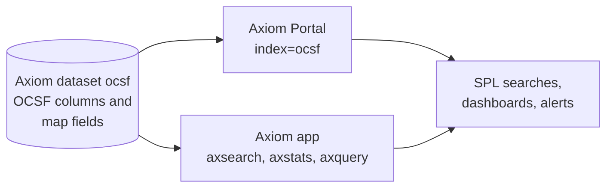

An [OCSF dataset in Axiom](/use-cases/ocsf) is an ordinary Axiom dataset, so both Splunk integrations search it like any other dataset. Analysts search OCSF events with SPL from the Splunk interface they already know, and pushed-down filters and aggregations run inside Axiom. This page covers the last step of the OCSF flow: searching OCSF data from Splunk.



The examples on this page use a dataset named `ocsf` that contains events conformed to the [Axiom OCSF schema](/use-cases/ocsf#the-axiom-ocsf-schema). Replace `ocsf` with the name of your dataset.

<Note>
In transparent mode, the Portal can also present an OCSF dataset as Splunk CIM data for CIM data models, `tstats`, and Enterprise Security searches. This is in preview. For more information, see [Search OCSF data as Splunk CIM](/splunk/portal/ocsf-cim).
</Note>

## Search OCSF data with the Portal

Through the [Axiom Portal for Splunk](/splunk/portal/overview), the OCSF dataset is an index like any other: `index=federated:ocsf` in standard mode, or `index=ocsf` in transparent mode. The following examples use transparent mode.

Events carry the native OCSF fields under their dotted names, such as `class_uid`, `user.name`, and `src_endpoint.ip`. Dotted field names take double quotes in SPL, as on any Splunk index. In `where` and `eval` expressions, use single quotes instead, for example `'user.name'`.

Count events by OCSF class:

```spl
index=ocsf | stats count by class_uid, class_name
```

Failed logons by user and source address. In the Authentication class (`3002`), `activity_id` `1` is a logon and `status_id` `2` is a failure:

```spl
index=ocsf class_uid=3002 activity_id=1 status_id=2
| stats count by "user.name", "src_endpoint.ip"
| sort - count
```

Bytes by destination for network traffic over time:

```spl
index=ocsf class_uid=4001
| timechart span=1h sum("traffic.bytes") by "dst_endpoint.ip"
```

Filters and aggregations like these are computed inside Axiom. For the full list of what runs in Axiom and what runs on the search head, see [SPL command support](/splunk/portal/spl-support).

As with any OCSF query, filter on the numeric `*_id` fields rather than their display strings. The IDs are fixed by OCSF, while producers spell the strings differently.

### Arrays of objects

Promoted arrays of objects, such as `observables`, `attacks`, and `vulnerabilities`, arrive as one field that contains the array as compact JSON. Arrays of scalar values, such as `email.to`, arrive as ordinary Splunk multivalue fields.

To work with the elements of an array of objects, extract them with `spath`. `spath` returns a multivalue field, which you can expand with `mvexpand`. For example, list the IP address observables in Detection Findings (`2004`):

```spl
index=ocsf class_uid=2004
| spath input=_raw path=observables{}.value output=observable
| mvexpand observable
| stats count by observable
```

`spath` and `mvexpand` run on the search head over the events Axiom returns, so filter the search first, for example by `class_uid`, to keep the number of events small. A search-time filter on an element, such as `observables{}.value=192.0.2.145`, matches nothing, because the field only exists after `spath` runs. Filter after `spath` instead:

```spl
index=ocsf class_uid=2004
| spath input=_raw path=observables{}.value output=observable
| search observable="192.0.2.145"
| table _time, "device.hostname", "finding_info.title", observable
```

### Fields in `unmapped`

Fields stored under the [`unmapped` map field](/use-cases/ocsf#the-axiom-ocsf-schema) appear in events as dotted fields that start with `unmapped.`, at any depth, for example `unmapped.device.os.name`.

In the base search, you can filter and aggregate only on fields one level below `unmapped`, such as `unmapped.vendor_field`. Most OCSF fields under `unmapped` are nested deeper. A base-search filter or `stats ... by` on a deeper field, such as `"unmapped.device.os.name"="Windows Server 2022"`, returns no results and no error. Filter on these fields after the events are returned instead, with `where` or `spath`:

```spl
index=ocsf class_uid=3002
| where 'unmapped.device.os.name'="Windows Server 2022"
| stats count by "user.name"
```

```spl
index=ocsf class_uid=3002
| spath input=_raw path=unmapped.device.os.name output=os
| stats count by os
```

These commands run on the search head over the events Axiom returns, not inside Axiom, so they get slower as the number of matching events grows. Narrow the base search first, for example by `class_uid` and time range.

To read an array inside `unmapped`, such as `unmapped.evidences`, extract its elements with `spath` in the same way:

```spl
index=ocsf class_uid=2004
| spath input=_raw path=unmapped.evidences{}.process.name output=evidence_process
| stats count by evidence_process
```

To filter or aggregate on a nested `unmapped` field inside Axiom, use APL, either in Axiom or with `axquery` in the Axiom app. For more information, see [Read fields from `unmapped`](/use-cases/ocsf/query#read-fields-from-unmapped).

## Search OCSF data with the Axiom app

The [Axiom for Splunk app](/splunk/app/setup) queries the dataset by name with its `ax` commands, and returns OCSF fields as Splunk fields.

In version 1.2.0 and later, the app names array fields the same way Splunk’s `spath` command does, so you don’t need `spath` for arrays:

- Nested objects become dotted field names, for example `src_endpoint.ip`.
- An array of scalar values becomes a multivalue field whose name ends in `{}`, for example `email.to{}`.
- Each attribute of an array of objects becomes a multivalue field named `<array>{}.<attribute>`, for example `observables{}.value`, `attacks{}.technique.uid`, and `unmapped.evidences{}.process.name`.

Failed logons, using the `q` syntax:

```spl
| axstats dataset="ocsf" q="class_uid=3002 activity_id=1 status_id=2" stats="count" by="user.name,src_endpoint.ip"
```

MITRE ATT&CK techniques in recent Detection Findings:

```spl
| axsearch dataset="ocsf" q="class_uid=2004" limit=1000
| stats count by "attacks{}.technique.uid", "device.hostname"
```

`axsearch` returns at most `limit` events, and `stats` runs on the search head over them, so these counts cover only the returned events.

For exact counts over the whole dataset, and for the full APL language, including map fields and arrays, run an APL query with `axquery`:

```spl
| axquery apl="['ocsf'] | where class_uid == 2004 | mv-expand observables | where toint(observables['type_id']) == 2 | summarize count() by ip = tostring(observables['value'])"
```

For more information, see [Commands](/splunk/app/commands).

## Choose between the Portal and the app

| | Axiom Portal for Splunk | Axiom for Splunk app |
| --- | --- | --- |
| Address the dataset | `index=ocsf`, or `index=federated:ocsf` in standard mode | `dataset="ocsf"` in an `ax` command |
| Arrays of objects such as `observables` | One JSON field. Extract elements with `spath` | Multivalue fields such as `observables{}.value` |
| Arrays of scalar values such as `email.to` | Multivalue field `email.to` | Multivalue field `email.to{}` |
| Nested fields under `unmapped` | Shown in events. Filter after the base search with `where` or `spath` | Shown in events. Filter inside Axiom with APL in `axquery` |
| Full APL, including map fields | No | Yes, with `axquery` |

For a general comparison of the two integrations, see [Axiom and Splunk](/splunk/overview).

## What’s next

- [Search OCSF data as Splunk CIM](/splunk/portal/ocsf-cim)
- [Query OCSF data with APL](/use-cases/ocsf/query)
- [SPL command support](/splunk/portal/spl-support)
- [Axiom for Splunk app commands](/splunk/app/commands)
