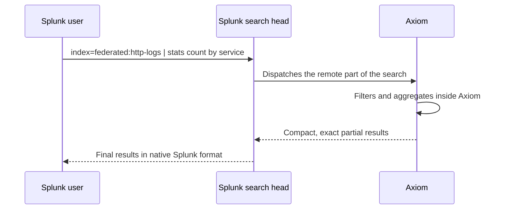
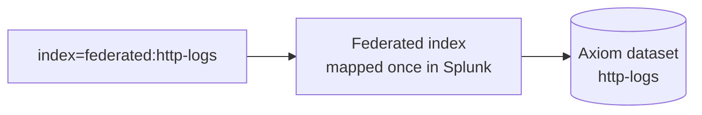
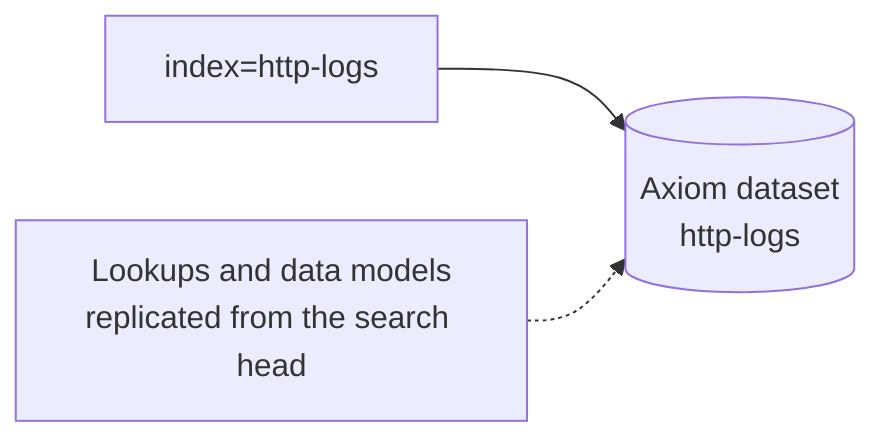

The Axiom Splunk Portal makes Axiom datasets appear as ordinary Splunk indexes. Anyone who knows SPL, or just knows how to click around Splunk dashboards, can search petabyte-scale Axiom data from their existing Splunk search head, live and with exact results.

The Portal implements the remote side of Splunk’s federated search protocol, the same protocol Splunk uses between its own deployments. Your Splunk search head registers the Portal as a federated provider and treats it like a remote Splunk peer. The Portal translates the dispatched work into Axiom queries, runs them inside Axiom, and streams results back in Splunk’s native result format. No data is copied into Splunk, and nothing is installed on the search head.

A Portal is an Axiom integration that speaks another tool’s own remote-data protocol, so Axiom appears natively inside that tool. The Splunk Portal is the first of the family.

## Where the work happens

The defining feature of the Splunk Portal is **pushdown**: the expensive parts of a search run inside Axiom, next to the data.

- **Pushed down to Axiom.** Filters, projections, and aggregations are translated and computed inside Axiom. A `stats count` over a billion events scans the data in Axiom and returns a handful of rows to Splunk. Pushed-down aggregations are exact at any dataset size, not sampled, and include `stats`, `timechart`, `chart`, `top`, `rare`, and `tstats`.
- **Run on the search head.** Streaming and transforming commands like `eval`, `rex`, `dedup`, and `transaction` run on the Splunk search head over the events Axiom returns, identical to how Splunk works with its own remote peers. Everything behaves like native SPL because it is native SPL.

This split means the Splunk search head’s limits stop mattering for anything except raw event retrieval. Aggregation results are effectively unbounded because they’re computed in Axiom. For the exact command-by-command breakdown, see [SPL command support](/splunk/portal/spl-support).

The Portal never degrades results silently. Whenever a result is trimmed or estimated, the search shows a WARN or INFO banner explaining what happened, and per-search Axiom metrics appear in Splunk’s Job Inspector. For details, see [Monitor and troubleshoot](/splunk/portal/troubleshoot).

## Two modes

Splunk federated search has two modes, and the Portal supports both.

**Standard mode** maps each Axiom dataset to a federated index that users address as `index=federated:<name>`. It’s explicit, simple to reason about, and the recommended starting point. Each dataset you expose is mapped once by a Splunk admin.

**Transparent mode** makes Axiom datasets directly addressable by their own names, as `index=<name>`, with zero per-dataset mapping. Splunk also replicates the search head’s knowledge bundle to Axiom, so your existing CSV lookups, automatic lookups, and data models work against Axiom data. Transparent mode works from Splunk Enterprise and Splunk Cloud Platform on the Victoria Experience.

| | Standard mode | Transparent mode |
| --- | --- | --- |
| Index syntax | `index=federated:http-logs` | `index=http-logs` |
| Per-dataset setup | One federated index per dataset | None |
| Splunk lookups over Axiom data | No | Yes, CSV and automatic lookups |
| Data models and `tstats` | Limited | Yes |
| Machine Learning Toolkit (MLTK) | Yes | Yes |
| Splunk Enterprise Security | Not supported by Splunk | Supported |
| Splunk editions | Splunk Enterprise and Splunk Cloud Platform | Splunk Enterprise and Splunk Cloud Platform (Victoria Experience) |

<Note>
If you use Splunk Enterprise Security, choose transparent mode. Splunk doesn’t support federated search in standard mode with Enterprise Security. For more information, see [Use federated searches in transparent mode with Splunk Enterprise Security](https://help.splunk.com/en/splunk-enterprise-security-8/user-guide/8.5/introduction/use-federated-searches-in-transparent-mode-with-splunk-enterprise-security) in the Splunk documentation.
</Note>

<Warning>
Use one mode per Splunk deployment. Registering both a standard and a transparent provider against the same Portal endpoint yields inconsistent results. This is a general caveat of Splunk federated search, not specific to Axiom.
</Warning>

## Supported Splunk versions

Axiom verifies the Splunk Portal against Splunk Enterprise 9.0 through 10.4 in both modes. Splunk Enterprise 9.0 or later is recommended.

The Portal supports Splunk Cloud Platform on the Victoria Experience, which all new Splunk Cloud instances use, in both modes. To check which experience your environment uses, see [Determine your Splunk Cloud Platform Experience](https://help.splunk.com/en/splunk-cloud-platform/administer/admin-manual/10.5.2605/get-started-managing-splunk-cloud-platform/determine-your-splunk-cloud-platform-experience) in the Splunk documentation.

## Security model

- The connection is always initiated by your Splunk search head over HTTPS. The Portal never connects into your network.
- Splunk authenticates with an Axiom API token that needs only query permissions on the datasets you choose to expose. Reads only, no ingest or management access.
- Revoking the token immediately removes Splunk’s access. For more information, see [Tokens](/reference/tokens).

## What’s next

- [Set up standard mode](/splunk/portal/set-up-standard)
- [Set up transparent mode](/splunk/portal/set-up-transparent)
- [SPL command support](/splunk/portal/spl-support)
- [Examples](/splunk/portal/examples)
