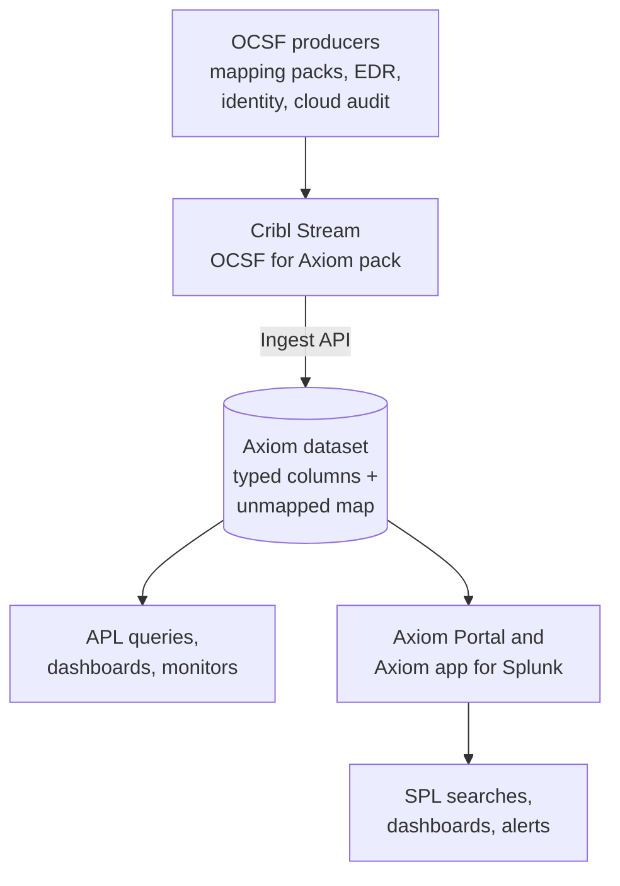
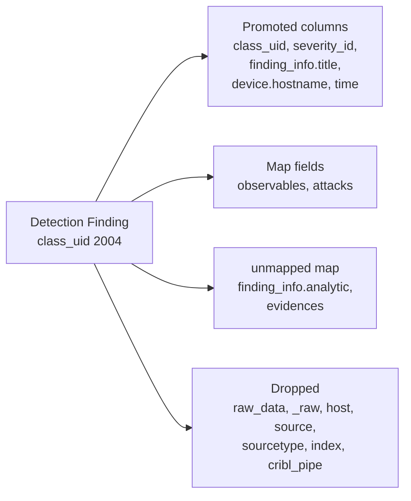

The [Open Cybersecurity Schema Framework](https://schema.ocsf.io) (OCSF) is an open standard for security events. Firewalls, EDR tools, identity providers, and cloud audit logs map their native formats onto a shared set of event classes such as Network Activity, Authentication, and Detection Finding. Each event names its class in `class_uid`, and fields like `src_endpoint.ip` or `user.name` mean the same thing whichever product produced them.

Axiom stores OCSF events in a dataset that follows the Axiom OCSF schema, a layout for OCSF 1.9.0 data. Every documented OCSF attribute up to a fixed depth becomes a typed Axiom column, and everything else is kept, not dropped, in a single `unmapped` map field. You query the result with APL in Axiom, or with SPL from Splunk through the Axiom Portal for Splunk and the Axiom for Splunk app.

## How OCSF data flows through Axiom



1. **Produce OCSF.** You already produce OCSF events, for example with Cribl’s OCSF mapping packs or a vendor’s native OCSF export that reaches Cribl Stream.
1. **Conform and send.** The OCSF for Axiom Cribl pack reshapes each event to the Axiom OCSF schema and sends it to Axiom’s ingest API. For more information, see [Send OCSF data to Axiom](/use-cases/ocsf/send-data).
1. **Store.** One dataset holds every OCSF class. You prepare it once so that the map fields the schema relies on are registered before data arrives.
1. **Query.** Query the dataset with APL. For more information, see [Query OCSF data](/use-cases/ocsf/query). Splunk users search the same dataset with SPL, or as CIM data for data models and Enterprise Security. For more information, see [Search OCSF data from Splunk](/splunk/portal/ocsf) and [Search OCSF data as Splunk CIM](/splunk/portal/ocsf-cim).

## The Axiom OCSF schema

The Axiom OCSF schema defines how OCSF 1.9.0 data is stored in Axiom. It fixes which OCSF attributes become columns, the Axiom type of each column, and where everything else goes. The OCSF for Axiom Cribl pack shapes events to it, and the Axiom Portal for Splunk reads data in that shape.

The full OCSF object graph nests recursively, so flattening every possible path isn’t practical: the full closure of OCSF 1.9.0 runs to over 100,000 paths. Instead, every OCSF attribute lands in exactly one of three places:

| Where | What goes there | How you query it |
| --- | --- | --- |
| **Promoted columns** | Every class attribute, the immediate scalar attributes of every object attribute (for example, `src_endpoint.ip` and `traffic.bytes`), and a few deeper objects whose attributes OCSF requires or that readers commonly need: `actor.user`, `actor.process`, `metadata.product`, `http_request.url`, `process.parent_process`, and `process.file`. Across all classes, the schema defines 1,636 columns, including the map fields in the next row. | As ordinary typed columns, for example `['src_endpoint.ip']` |
| **Map fields** | Six arrays of objects kept whole so that their elements stay paired: `observables`, `vulnerabilities`, `answers`, `attacks`, `file.hashes`, and `process.file.hashes`. Also 16 OCSF attributes whose type is a free-form JSON object, such as `resource.data`. | With index notation, for example `['attacks'][0]['technique']['uid']` |
| **`unmapped`** | Everything else: deeper subtrees, other arrays of objects, vendor extensions, and attributes from newer or older OCSF versions. The original nesting is preserved. | With index notation, for example `['unmapped']['device']['os']['name']` |

Events are sparse. A dataset’s columns are the union of the classes you send, and each event fills only the columns of its own class. Axiom adds a column when an event first populates it, so a dataset contains only the columns your producers actually use, far fewer than 1,636. Check the number of fields your plan allows in [Limits](/reference/limits).

The schema follows three reading rules:

- `class_uid` is the discriminator. Filter and branch on it.
- Enumerations are ID-first. Trust the `*_id` integers, such as `status_id`, rather than their display-string siblings, such as `status`, which vary between vendors.
- `time` is the event time in epoch milliseconds, and `_time` is set from it.

## What happens to one event

The diagram below follows a Detection Finding from the OCSF for Axiom pack’s synthetic sample data as it’s conformed:



- `finding_info.title` and `device.hostname` are immediate scalars of class attributes, so they become columns.
- `observables` and `attacks` are promoted arrays of objects. Each is stored whole in its own map field, so a technique ID stays next to its tactic.
- `finding_info.analytic` is an object nested inside an object, and `evidences` is an array of objects that isn’t promoted. Both move under `unmapped`.
- `raw_data` holds a full copy of the original event, and `_raw`, `host`, `source`, `sourcetype`, `index`, and `cribl_pipe` are Splunk and Cribl transport fields. The Cribl pack removes all of them. You can choose to keep `raw_data`, in which case it’s stored under `unmapped`.

Below is a Palo Alto Networks traffic event, class `4001`, before and after the OCSF for Axiom pack. The values are from the pack’s synthetic sample data and its expected test output, trimmed for readability.

<Tabs>
<Tab title="Before: from an OCSF mapping pack">

```json
{
  "_raw": ",,007200001056,TRAFFIC,end,1,2026/08/17 12:53:20,10.14.6.57,203.0.113.9,…",
  "_time": 1787000000,
  "host": "fw01.example.com",
  "sourcetype": "pan:traffic",
  "source": "pan:syslog",
  "index": "pan_logs",
  "cribl_pipe": "Palo-Alto-Networks_traffic-threat_OCSF-4001",
  "class_uid": 4001,
  "class_name": "Network Activity",
  "activity_name": "Closed",
  "status_id": 1,
  "time": 1787000000123456,
  "raw_data": ",,007200001056,TRAFFIC,end,1,2026/08/17 12:53:20,10.14.6.57,203.0.113.9,…",
  "metadata": {
    "version": "1.0.0-rc.2",
    "product": {
      "name": "Firewall",
      "vendor_name": "Palo Alto Networks",
      "feature": { "name": "TRAFFIC" }
    }
  },
  "src_endpoint": { "ip": "10.14.6.57", "port": 58102 },
  "dst_endpoint": { "ip": "203.0.113.9", "port": 443, "svc_name": "allow-web" },
  "connection_info": { "direction_id": 2, "protocol_name": "TCP" },
  "traffic": { "bytes": 1520, "bytes_in": 560, "bytes_out": 960 }
}
```

</Tab>
<Tab title="After: conformed by the pack">

```json
{
  "_time": "2026-08-17T20:53:20.123Z",
  "class_uid": 4001,
  "class_name": "Network Activity",
  "activity_name": "Closed",
  "status_id": 1,
  "time": 1787000000123,
  "metadata": {
    "version": "1.0.0-rc.2",
    "product": {
      "name": "Firewall",
      "vendor_name": "Palo Alto Networks"
    }
  },
  "src_endpoint": { "ip": "10.14.6.57", "port": 58102 },
  "dst_endpoint": { "ip": "203.0.113.9", "port": 443, "svc_name": "allow-web" },
  "connection_info": { "direction_id": 2, "protocol_name": "TCP" },
  "traffic": { "bytes": 1520, "bytes_in": 560, "bytes_out": 960 },
  "unmapped": {
    "metadata": { "product": { "feature": { "name": "TRAFFIC" } } }
  }
}
```

</Tab>
</Tabs>

| Change | Before | After |
| --- | --- | --- |
| Event time | `time` in microseconds: `1787000000123456` | `time` in milliseconds, as OCSF requires: `1787000000123`. `_time` is set from it, so Axiom stores the event at its real time with millisecond precision. |
| Duplicate payload | `raw_data` repeats the whole original log line | Dropped, which roughly halves the event size |
| Transport fields | `_raw`, `host`, `sourcetype`, `source`, `index`, `cribl_pipe` | Dropped |
| Deep attribute | `metadata.product.feature.name` | Moved to `['unmapped']['metadata']['product']['feature']['name']` |
| Everything else | Nested JSON | Unchanged. At ingest, Axiom flattens the nested objects into dotted columns such as `src_endpoint.ip` and `traffic.bytes`, and keeps `unmapped` as one map field |

## Use one dataset

Send all OCSF classes to one dataset, for example `ocsf`. The most common security workflow is an entity investigation, such as everything a user or host touched, and it spans authentication, network, and endpoint classes. With one dataset, that’s one query. Readers branch on `class_uid`, not on dataset names.

Split OCSF data into more datasets only when you need different retention, for example high-volume network flow and DNS events on short retention in `ocsf_flow`, and findings on long retention in `ocsf`. Each dataset is prepared the same way and follows the same schema.

## What’s next

- [Send OCSF data to Axiom](/use-cases/ocsf/send-data)
- [Query OCSF data](/use-cases/ocsf/query)
- [Search OCSF data from Splunk](/splunk/portal/ocsf)
