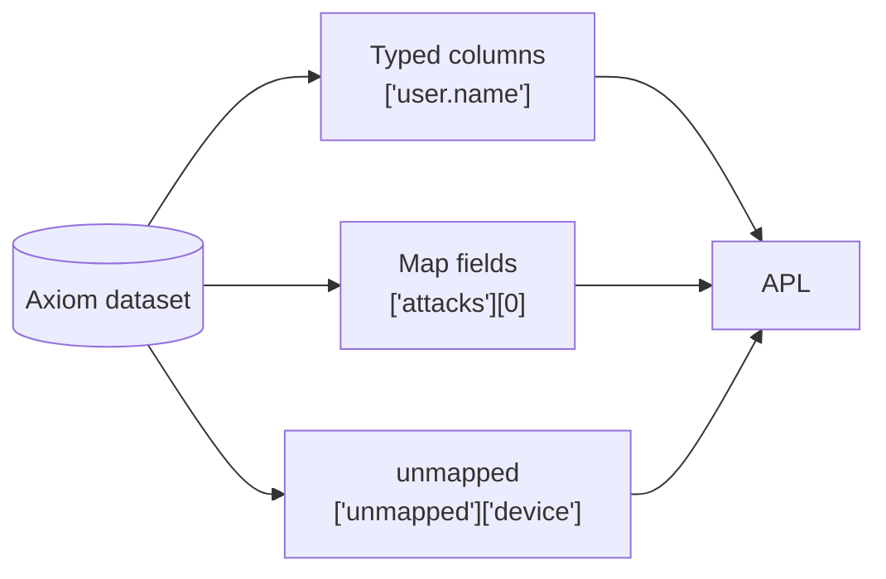

This page shows how to query an OCSF dataset with APL. It covers the end of the OCSF flow in Axiom: the dataset is prepared and receives conformed events, as described in [Send OCSF data to Axiom](/use-cases/ocsf/send-data). To search the same data from Splunk, see [Search OCSF data from Splunk](/splunk/portal/ocsf).



The examples run against the 100 synthetic events in the OCSF for Axiom pack’s `axiom_normalize_post_processor` sample after conforming. The outputs show what each query returns for that sample. Replace `ocsf` with the name of your dataset.

## Choose the right reference

Every OCSF attribute lives in exactly one place. The place determines how you reference it in APL:

| Attribute | Stored as | APL reference |
| --- | --- | --- |
| `class_uid`, `severity_id` | Promoted column | `class_uid` |
| `user.name`, `src_endpoint.ip` | Promoted column | `['user.name']` |
| `attacks`, `observables` | Map field, array of objects | `['attacks'][0]['technique']['uid']` |
| `device.os.name` | Under `unmapped` | `['unmapped']['device']['os']['name']` |

Column names that contain dots must be quoted with brackets, for example `['src_endpoint.ip']`. For more information, see [Entity names](/apl/entities/entity-names#quote-identifiers). Inside map fields, use index notation for each level. For more information, see [Map fields](/apl/data-types/map-fields#access-properties-of-nested-maps).

To see which columns your dataset actually contains, use `getschema`. If an attribute isn’t a column, it’s either inside a map field or under `unmapped`:

```kusto
['ocsf']
| getschema
```

Filter and group on numeric `*_id` columns rather than their string siblings. For example, use `status_id == 2` rather than `status == 'Failure'`. Producers spell the strings differently, but the IDs are fixed by OCSF. The [OCSF schema browser](https://schema.ocsf.io) lists the meaning of every ID.

## Count events by class

Start with an inventory of the classes in the dataset:

```kusto
['ocsf']
| summarize events = count() by class_uid, class_name
| sort by events desc
```

| class_uid | class_name | events |
| --- | --- | --- |
| 4001 | Network Activity | 40 |
| 4003 | DNS Activity | 15 |
| 3002 | Authentication | 15 |
| 1007 | Process Activity | 10 |
| 4002 | HTTP Activity | 10 |
| 2004 | Detection Finding | 5 |
| 6003 | API Activity | 5 |

## Filter on promoted columns

Failed logons by user and source address. In the Authentication class (`3002`), `activity_id` `1` is a logon, `status_id` `2` is a failure, and `user` is the account that tried to log on:

```kusto
['ocsf']
| where class_uid == 3002 and activity_id == 1 and status_id == 2
| summarize failures = count() by ['user.name'], ['src_endpoint.ip'], status_detail
| sort by failures desc
```

| user.name | src_endpoint.ip | status_detail | failures |
| --- | --- | --- | --- |
| heidi | 10.24.111.174 | Unknown user name or bad password. | 1 |
| dave | 10.30.177.45 | Unknown user name or bad password. | 1 |
| alice | 10.25.217.127 | Unknown user name or bad password. | 1 |

Promoted columns are typed, so numeric comparisons and sums need no conversion. Top destinations by bytes in Network Activity (`4001`):

```kusto
['ocsf']
| where class_uid == 4001
| summarize bytes = sum(['traffic.bytes']) by ['dst_endpoint.ip']
| top 3 by bytes
```

| dst_endpoint.ip | bytes |
| --- | --- |
| 198.51.100.182 | 441038 |
| 192.0.2.51 | 405202 |
| 198.51.100.193 | 403470 |

## Read fields from `unmapped`

`unmapped` keeps the original OCSF nesting, so you read a field with one index per level. Values inside a map field are dynamic, so convert them with `tostring`, `toint`, or a similar function before you group or compare. The operating system of the device that recorded each logon is under `unmapped` because `device.os` is an object inside an object:

```kusto
['ocsf']
| where class_uid == 3002
| extend os = tostring(['unmapped']['device']['os']['name'])
| summarize events = count() by os
```

| os | events |
| --- | --- |
| Windows Server 2022 | 15 |

To find which keys each class carries under `unmapped`, list the top-level keys with [`bag_keys`](/apl/scalar-functions/array-functions/bag-keys) and expand them into rows:

```kusto
['ocsf']
| where isnotnull(unmapped)
| extend keys = bag_keys(unmapped)
| mv-expand keys
| summarize events = count() by class_name, key = tostring(keys)
| sort by class_name asc, key asc
```

| class_name | key | events |
| --- | --- | --- |
| API Activity | actor | 5 |
| API Activity | api | 5 |
| API Activity | cloud | 5 |
| API Activity | metadata | 5 |
| Authentication | device | 15 |
| Authentication | metadata | 15 |
| Detection Finding | evidences | 5 |
| Detection Finding | finding_info | 5 |
| Network Activity | metadata | 40 |
| Process Activity | device | 10 |

The Detection Finding events also show an array of objects under `unmapped`. Index into it like any other array:

```kusto
['ocsf']
| where class_uid == 2004
| project ['device.hostname'],
    rule = tostring(['unmapped']['finding_info']['analytic']['name']),
    process = tostring(['unmapped']['evidences'][0]['process']['name'])
```

| device.hostname | rule | process |
| --- | --- | --- |
| wks-014.corp.example.com | Rare destination | rundll32.exe |
| srv-db-02.corp.example.com | Rare destination | rundll32.exe |
| … | … | … |

Querying a map field uses more query-hours than querying a column. If you query an `unmapped` field often, define a [virtual field](/query-data/virtual-fields) for it so your team can reuse it by name.

## Query arrays of objects

The six promoted arrays, `observables`, `vulnerabilities`, `answers`, `attacks`, `file.hashes`, and `process.file.hashes`, are each stored whole in their own map field. Every element keeps its own attributes, so an observable’s value stays next to its type and a technique stays next to its tactic.

To read one element, index it:

```kusto
['ocsf']
| where class_uid == 2004
| project ['finding_info.title'], ['device.hostname'],
    technique = tostring(['attacks'][0]['technique']['uid']),
    tactic = tostring(['attacks'][0]['tactic']['name'])
```

| finding_info.title | device.hostname | technique | tactic |
| --- | --- | --- | --- |
| Suspicious outbound connection | wks-014.corp.example.com | T1071 | Command and Control |
| Suspicious outbound connection | srv-db-02.corp.example.com | T1071 | Command and Control |
| … | … | … | … |

To work with every element, expand the array into rows with [`mv-expand`](/apl/tabular-operators/mv-expand). For example, list every IP address observable in Detection Findings. In observables, `type_id` `2` is an IP address:

```kusto
['ocsf']
| where class_uid == 2004
| mv-expand observables
| where toint(observables['type_id']) == 2
| summarize findings = count() by ip = tostring(observables['value'])
```

| ip | findings |
| --- | --- |
| 192.0.2.145 | 1 |
| 198.51.100.15 | 1 |
| 192.0.2.221 | 1 |
| 192.0.2.199 | 1 |
| 203.0.113.35 | 1 |

To pull one attribute from every element without expanding rows, use [`array_extract`](/apl/scalar-functions/array-functions/array-extract). It returns an array per event:

```kusto
['ocsf']
| where class_uid == 2004
| extend techniques = array_extract(['attacks'], @'$[*].technique.uid')
| project ['device.hostname'], techniques
```

## Investigate an entity across classes

Because all classes share one dataset and one vocabulary, one query can follow an entity across event types. Everything the sample recorded about one workstation:

```kusto
['ocsf']
| where ['device.hostname'] == 'wks-014.corp.example.com'
    or ['src_endpoint.hostname'] == 'wks-014.corp.example.com'
    or ['dst_endpoint.hostname'] == 'wks-014.corp.example.com'
| summarize events = count() by class_name
```

| class_name | events |
| --- | --- |
| Detection Finding | 2 |
| Process Activity | 2 |

Events are sparse: each class fills only its own columns. In cross-class queries, expect empty values in columns that a class doesn’t use, and guard with `isnotnull` or `isnotempty` where it matters.

## What’s next

- [Search OCSF data from Splunk](/splunk/portal/ocsf)
- [Map fields](/apl/data-types/map-fields)
- [APL overview](/apl/introduction)
