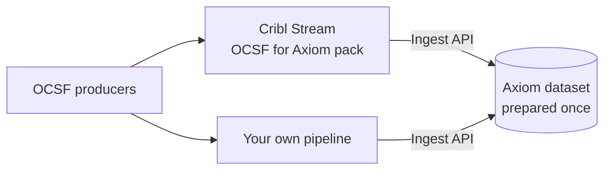
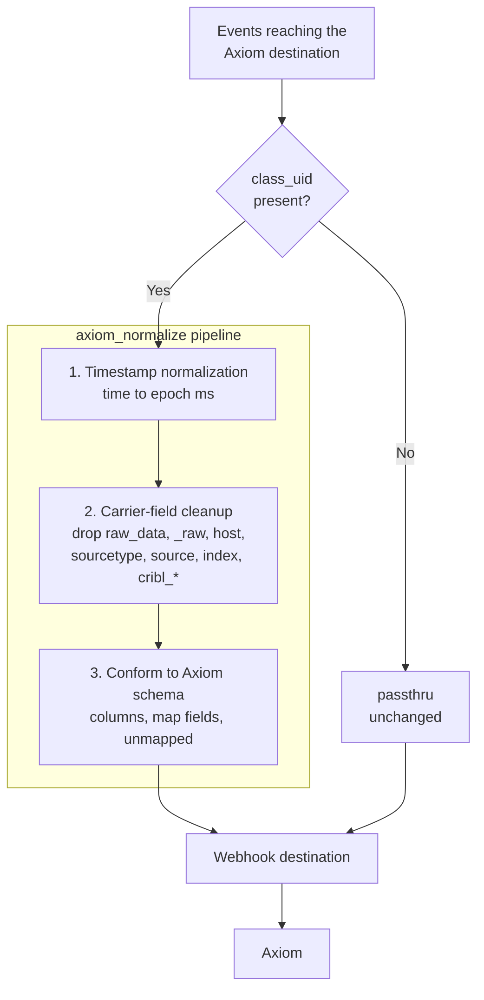

import ReplaceDomain from "@/content/snippets/replace-domain.mdx"
import ReplaceDatasetToken from "@/content/snippets/replace-dataset-token.mdx"
import CriblWebhookDestination from "@/content/snippets/cribl-webhook-destination.mdx"

This page explains how to get OCSF events into an Axiom dataset in the shape that the [Axiom OCSF schema](/use-cases/ocsf#the-axiom-ocsf-schema) describes. It covers the middle of the OCSF flow: preparing the dataset once, then sending events from Cribl Stream or from your own pipeline.



## Prerequisites

- [Create an Axiom account](https://app.axiom.co/register).
- [Create an advanced API token](/reference/tokens#create-advanced-api-token) that can create datasets and ingest data into them. You can use a separate token with only ingest permission for the pipeline that sends data.
- Find the [edge deployment](/reference/edge-deployments) of your organization. You send data to its base domain.

## Prepare the dataset

An OCSF dataset needs 23 map fields registered before the first event arrives: the `unmapped` overflow map, the 16 OCSF attributes whose type is a free-form JSON object, and the six promoted arrays of objects, such as `observables` and `attacks`. Without them, Axiom flattens these fields at ingest and their structure is lost. Registering a map field affects only events ingested afterwards, so prepare the dataset before you send data. For more information, see [Map fields](/apl/data-types/map-fields).

The OCSF for Axiom pack ships a script that creates the dataset and registers all 23 map fields. It needs only `sh` and `curl`, so you can run it whether or not you use Cribl. Find the script in the pack’s [GitHub repository](https://github.com/axiomhq/cribl-axiom-ocsf) or inside the pack’s downloaded `.crbl` file, which is a gzipped tarball.

```bash
AXIOM_TOKEN=API_TOKEN DATASET=DATASET_NAME sh scripts/setup-dataset.sh
```

<Info>
<ReplaceDatasetToken />
</Info>

The script prints one line per map field and ends with:

```
dataset DATASET_NAME created
map field access_result registered
map field application.data registered
…
map field file.hashes registered
map field process.file.hashes registered
dataset DATASET_NAME ready (23 map fields)
```

The script is idempotent and safe to re-run. If the dataset already exists, it prints `dataset DATASET_NAME exists`. Fields already registered print `map field <name> already registered` and are skipped. The script calls `https://api.axiom.co` by default. Set `AXIOM_API` to call another API base URL.

To check the result, go to the Datasets tab, select the dataset, and check that the fields are labeled as map fields. For more information, see [View map fields](/apl/data-types/map-fields#view-map-fields).

<Note>
A new version of the schema can add map fields. When the pack’s release notes say so, re-run the script from the new version. It registers only the missing fields.
</Note>

## Send OCSF data from Cribl Stream

The OCSF for Axiom pack (pack ID `cc-stream-axiom-ocsf`) takes the OCSF events you already produce in Cribl Stream, for example with the OCSF Post Processor or other OCSF mapping packs, and conforms them to the Axiom OCSF schema. It works with OCSF 1.9.0 and with older producers, such as the OCSF 1.0 and 1.1 events that Amazon Security Lake packs emit. If you already send OCSF to Amazon Security Lake from Cribl, you can route a copy of the same stream to Axiom.

The pack contains routes, one pipeline, global variables, and sample data. It doesn’t contain sources, destinations, credentials, or lookups.



The pack’s `axiom_normalize` route sends every event that has a `class_uid` to the `axiom_normalize` pipeline. All other events go through Cribl’s built-in `passthru` pipeline unchanged. The pipeline has three function groups:

1. **Timestamp normalization.** Detects whether `time` is in seconds, milliseconds, microseconds, or nanoseconds by its magnitude and rewrites it to epoch milliseconds, as OCSF requires. Events without a usable numeric `time` take it from Cribl’s `_time`.
1. **Carrier-field cleanup.** Drops `raw_data`, which Security Lake-oriented packs fill with the whole original event. Strips the transport fields `_raw`, `sourcetype`, `source`, `host`, `index`, and `cribl_*`.
1. **Conform to Axiom schema.** Keeps the 1,636 schema column paths, captures map fields and promoted arrays of objects whole, and moves every other path under `unmapped` with its nesting preserved. Sets `_time` to the event time as an ISO 8601 string.

To see the result on a real event, see [What happens to one event](/use-cases/ocsf#what-happens-to-one-event).

<Steps>
<Step title="Prepare the dataset">
Run `scripts/setup-dataset.sh` as described in [Prepare the dataset](#prepare-the-dataset).
</Step>
<Step title="Install the pack">
Download `cc-stream-axiom-ocsf-1.0.1.crbl` from the pack’s [GitHub release](https://github.com/axiomhq/cribl-axiom-ocsf/releases/tag/v1.0.1). In Cribl Stream, go to **Processing > Packs**, click **Add Pack > Import from File**, and select the downloaded file.

<Note>
The OCSF for Axiom pack is coming soon to the Cribl Packs Dispensary. Until then, install it from the GitHub release.
</Note>
</Step>
<Step title="Create a Webhook destination">
Cribl Stream has no dedicated Axiom destination. The stock Webhook destination sends batched, compressed NDJSON straight to Axiom’s ingest API. In Cribl Stream, create a **Webhook** destination with the following settings.

<CriblWebhookDestination />

In **Processing Settings > Post-Processing**, clear **System fields**. By default, Cribl adds `cribl_pipe` to every event, which would land in `unmapped`.
</Step>
<Step title="Attach the pack">
On the Webhook destination, set **Processing Settings > Post-Processing > Pipeline** to the OCSF for Axiom pack. Alternatively, in QuickConnect, connect your source to the destination with the pack as the pipeline. You don’t need a route filter: the pack’s own routes send OCSF events through `axiom_normalize` and pass everything else through unchanged.

<Warning>
Attach the pack to the Axiom destination only, not to a processing pipeline that other destinations share. The pack rewrites events for Axiom, for example it turns `_time` into a string and removes transport fields, and other destinations would receive the same Axiom-shaped events.
</Warning>
</Step>
<Step title="Preview the samples">
In the pack’s pipeline preview, load the shipped samples to see the normalization before data flows:

- `axiom_normalize_post_processor`: 100 synthetic OCSF events across seven classes in the shape the OCSF Post Processor produces, with microsecond `time`, `raw_data` populated, and Splunk carrier fields present.
- `axiom_normalize_time_units`: 42 synthetic events whose `time` is in seconds, milliseconds, microseconds, nanoseconds, numeric strings, ISO strings, or missing. Some carry vendor extension fields that move under `unmapped`.
</Step>
<Step title="Verify in Axiom">
After data flows, count events by OCSF class:

```kusto
['DATASET_NAME']
| summarize count() by class_uid, class_name
```

`_time` should match the event time, not the ingest time. If events land in 1970 or far in the future, a producer emits an unusual time unit. Report it with a sanitized sample in the pack’s [GitHub issues](https://github.com/axiomhq/cribl-axiom-ocsf/issues).
</Step>
</Steps>

### Optional pipeline settings

- **Keep `raw_data`.** In the **Carrier-field cleanup** group, turn off the Eval function whose description starts with “Drop `raw_data`”. The value is then stored under `unmapped.raw_data`.
- **Upgrade a modified pack.** Cribl Stream blocks upgrades of a pack you changed locally, for example by turning off the `raw_data` drop. Install the new version under a new ID, re-apply your changes, point the destination’s post-processing pipeline at the new pack, preview the samples, and remove the old pack.

### Why these settings

The pack’s maintainers tested the Webhook settings in Cribl Stream 4.19.2, with one Worker Process on 2 CPUs, against a local mock of Axiom’s ingest API that counts every event it accepts. The events were synthetic OCSF of about 700 bytes each after conforming. These are local results, not Axiom production measurements.

- **Batching.** Requests carried up to about 6,000 of these events, 4 MB uncompressed, within Axiom’s 10,000-event limit. With very small events and no events-per-request limit, Cribl sent requests of over 29,000 events. A limit of `10000` kept requests within Axiom’s 10,000-event limit.
- **Compression.** gzip reduced the bytes sent from 707 to 79 per event, about 9 times fewer. Throughput with and without gzip differed by less than the run-to-run variation.
- **Retries.** With the `430` row, batches answered with `429`, `430`, or `503` were retried, and each of 3,000 events arrived exactly once. Without the `430` row, both rejected batches, 2,000 events in total, were dropped.
- **Persistent Queue.** During a sustained `503` outage, 400,000 events spilled about 795 MB to disk. After recovery, all 400,000 were delivered, with 2 duplicates, in each of 2 runs.
- **Pipeline cost.** In 3 runs of 100,000 events each, the pack roughly doubled CPU time per event for the whole container: 80 to 93 microseconds, against 40 to 48 without it. End-to-end throughput with one Worker Process averaged 10,000 to 12,000 events per second, against about 19,000 without the pack. Add Worker Processes for higher volume.

## Send OCSF data from your own pipeline

If you don’t use Cribl, conform each event to the schema before you send it, then send it to the [ingest API](/restapi/ingest). A conformed event is nested JSON:

- Keep every path that is a column in the schema’s `columns.json` file as a nested key. Axiom flattens nested objects into dotted columns such as `src_endpoint.ip`.
- Keep each map field and promoted array of objects whole at its path.
- Move every other path under `unmapped`, preserving its nesting.
- Set `time` to epoch milliseconds and `_time` to the same instant.

The [Axiom OCSF schema repository](https://github.com/axiomhq/ocsf) contains `scripts/rewrite.mjs`, the reference implementation of these rules. The Cribl pack’s conform step is a port of it. Prepare the dataset with the setup script first, then send conformed events:

```bash
curl -X 'POST' 'https://AXIOM_DOMAIN/v1/ingest/DATASET_NAME' \
  -H 'Authorization: Bearer API_TOKEN' \
  -H 'Content-Type: application/x-ndjson' \
  --data-binary @conformed.ndjson
```

<Info>
<ReplaceDomain />
<ReplaceDatasetToken />
</Info>

Send at most 10,000 events per request, and retry requests that return `429` or `430`. For more information, see [Limits](/reference/limits).

## What’s next

- [Query OCSF data](/use-cases/ocsf/query)
- [Search OCSF data from Splunk](/splunk/portal/ocsf)
