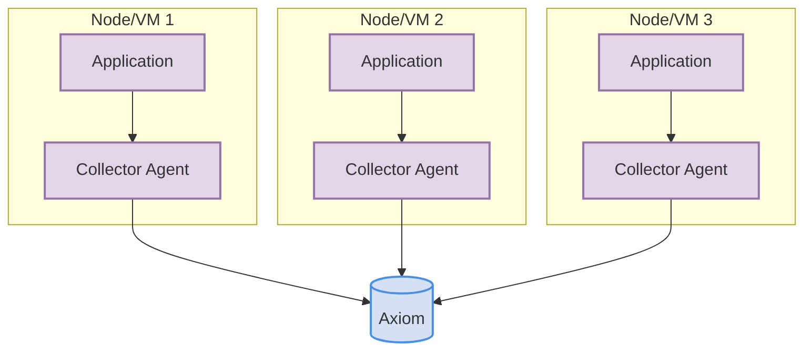
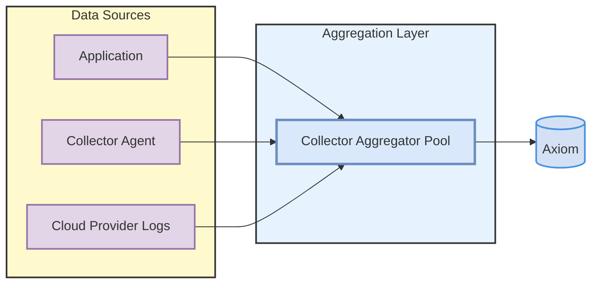

import ReplaceDatasetToken from "/snippets/replace-dataset-token.mdx"
import ReplaceDomain from "/snippets/replace-domain.mdx"

Successfully adopting a new platform at scale requires a robust and reliable data collection strategy. In complex distributed systems, how you collect and forward telemetry is as important as the platform that analyzes it.

While Axiom is flexible and supports dozens of [methods](/send-data/methods), there is a confident, battle-tested recommendation for large-scale environments. This guide outlines Axiom’s recommended architectural patterns using two popular tools: the [OpenTelemetry Collector](https://opentelemetry.io/docs/collector/) and [Vector](https://vector.dev/).

These patterns are designed to provide:
* **Resilience:** Ensure no data is lost during network partitions or downstream issues.
* **Enrichment:** Add valuable, consistent metadata to all your telemetry at the source.
* **Performance:** Offload processing and batching from your applications.
* **Governance:** Centrally manage data routing, filtering, and sampling to control costs.

<Tip>
While these patterns are recommended for large-scale environments, Axiom has many other simpler [methods](/send-data/methods) available to send data.
</Tip>

---

## The core patterns

There are two primary deployment patterns for a collector: the Agent model and the Aggregator model. Most large organizations use a hybrid of both.

<Info>
Most organizations find it easy to send data to Axiom. If you are having trouble, please [contact](https://axiom.co/contact) the Axiom team for help. We can provide ad-hoc guidance or design tailored implementation services for larger projects.
</Info>

### Agent pattern

In this model, a lightweight collector runs as an agent on every host or as a sidecar in every pod. It's responsible for collecting telemetry from applications on that specific node and forwarding it directly to Axiom.

**Best for:** Capturing rich, host-specific metadata (e.g., `k8s.pod.name`, `host.id`) and providing a resilient, decentralized collection point with local buffering.



### Aggregator pattern

In this model, a separate, horizontally-scalable pool of collectors acts as a centralized aggregation layer. Applications and agents send their data to this layer, which then handles final processing, enrichment, and forwarding to Axiom.

**Best for:** Centralized control over data routing and filtering, managing data from sources that cannot run an agent (e.g., third-party APIs, cloud provider log streams), and simplifying management by maintaining a small fleet of aggregators instead of thousands of agents.



---

## Tool recommendations

Both the OpenTelemetry Collector and Vector are excellent choices that can be deployed in either an Agent or Aggregator pattern. The best choice depends on your team's existing ecosystem and primary use case.

### OpenTelemetry Collector

The [OpenTelemetry Collector](https://opentelemetry.io/docs/collector/) is the CNCF-backed, vendor-neutral standard for collecting and processing telemetry. It's the ideal choice when your organization is standardizing on the OpenTelemetry framework for all signals (logs, metrics, and traces).

**Use the OTel Collector when:**
* You are instrumenting your applications with OpenTelemetry SDKs.
* You need to process traces, metrics, and logs in a single, unified pipeline.
* You want to align with the fastest-growing standard in the observability community.

Axiom natively supports the OpenTelemetry Line Protocol (OTLP). Configuring the collector to send data to Axiom is simple.

{/* TODO: Check configuration for OpenTelemetry Collector */}

**Example Collector Configuration (`otel-collector-config.yaml`):**

```yaml
exporters:
  otlphttp:
    compression: gzip
    endpoint: https://AXIOM_DOMAIN
    headers:
      authorization: Bearer API_TOKEN
      x-axiom-dataset: DATASET_NAME

service:
  pipelines:
    traces:
      receivers:
        - otlp
      processors:
        - memory_limiter
        - batch
      exporters:
        - otlphttp
```

<Info>
<ReplaceDomain />
<ReplaceDatasetToken />
</Info>

### Vector

[Vector](https://vector.dev/) is a high-performance, Rust-based observability data pipeline. It excels at log collection and transformation, offering a powerful domain-specific language (VRL) for complex data manipulation.

**Use Vector when:**
* Your primary focus is on logs from a wide variety of sources (files, syslog, APIs).
* You need to perform complex parsing, filtering, enrichment, or redaction on your event data.
* You require an extremely lightweight and memory-efficient agent for edge deployments.

Vector has a [native sink](https://vector.dev/docs/reference/configuration/sinks/axiom/) for Axiom, making configuration straightforward.

{/* TODO: Check configuration for Vector */}

**Example Vector Configuration (`vector.toml`):**

```toml
[sources.VECTOR_SOURCE_ID]
type = "file"
include = ["PATH_TO_LOGS"]

[sinks.SINK_ID]
type = "axiom"
inputs = ["VECTOR_SOURCE_ID"]
token = "API_TOKEN"
dataset = "DATASET_NAME"
```

<Info>
Replace `VECTOR_SOURCE_ID` with the Vector source ID.
Replace `PATH_TO_LOGS` with the path to the log files. For example, `/var/log/**/*.log`.
Replace `SINK_ID` with the sink ID.
<ReplaceDatasetToken />
</Info>

---

## Summary

| Aspect | OpenTelemetry Collector | Vector |
|:---|:---|:---|
| **Primary Use Case** | Unified pipeline for logs, metrics, and traces | High-performance log collection and transformation |
| **Ecosystem** | CNCF and OpenTelemetry standard | Standalone, broad source/sink compatibility |
| **Transformation** | Processors (limited for complex logic) | Vector Remap Language (VRL) for advanced logic |
| **Performance** | Excellent | Excellent, often with lower resource footprint for logs |

Both are first-class choices for sending data to Axiom. Your decision should be based on whether you need a unified OTel pipeline or a specialized, high-performance log processing tool.

### What's next?

* Explore the complete range of options for sending data in the [Methods](/send-data/methods) page.
* For direct ingestion, see the [Axiom REST API](/restapi/introduction).